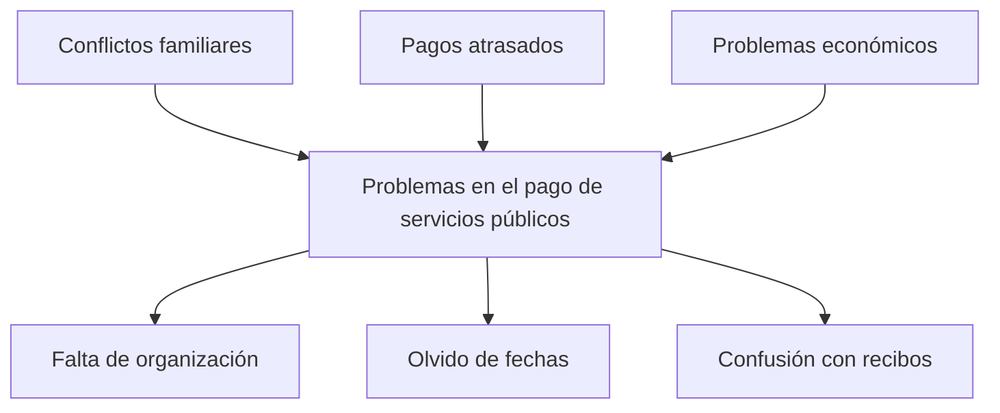

# JUAN PABLO CUELLAR OVALLE

## CONTEXTO PROBLEMÁTICA
Muchas familias presentan dificultades para organizar y pagar los servicios públicos.  
Con frecuencia se atrasan, se confunden con los recibos o simplemente olvidan las fechas de vencimiento.  
Esto genera problemas económicos, discusiones familiares y falta de organización en el hogar.  
## ÁRBOL DE PROBLEMAS

# PROMPT
El texto que se utilizó para generar las posibles soluciones fue el siguiente:

*"ChatGPT, necesito que me ayudes a solucionar la problemática que tienen muchas familias
con el pago de los servicios públicos. Normalmente se atrasan, se confunden con los recibos,
o se olvidan de las fechas de vencimiento, lo que trae problemas económicos y de convivencia.
Por favor dame diferentes ideas de soluciones tecnológicas que puedan ayudar a organizar y
facilitar estos pagos."*
## SOLUCIONES TECNOLÓGICAS

### 1) Aplicación móvil con recordatorios automáticos  
**Descripción:** Una app sencilla que avise con notificaciones cuando se acerque la fecha de pago de los servicios públicos. Puede incluir alertas personalizadas y sincronización con el calendario del celular.  

**Público objetivo:** Familias y personas que tienen dificultades para recordar fechas de vencimiento de recibos.  

**Problema que resuelve:** Muchas familias se atrasan en los pagos porque olvidan las fechas. Esta app les recuerda a tiempo y evita recargos o cortes de servicio.  

### 2) Calendario compartido para la familia  
**Descripción:** Un calendario digital en el que todos los miembros de la familia pueden consultar las fechas de vencimiento de los servicios públicos. Se pueden programar alertas y roles para que distintos integrantes participen en la organización.  

**Público objetivo:** Familias que desean organizarse mejor y distribuir responsabilidades en el hogar.  

**Problema que resuelve:** El pago de servicios suele recaer en una sola persona, lo que genera confusión o sobrecarga. Con el calendario compartido se reparte la responsabilidad y se evita el olvido.  

### 3) Aplicación que centraliza los pagos  
**Descripción:** Una plataforma que reúne todos los servicios públicos en un solo lugar, permitiendo gestionarlos y pagarlos sin confusión. Ofrece historial de pagos, recordatorios automáticos y reportes de gastos.  

**Público objetivo:** Familias y usuarios que manejan varios recibos y buscan una solución práctica y centralizada.  

**Problema que resuelve:** La dispersión de recibos y la confusión al pagar diferentes servicios en distintas plataformas. Centraliza todo y mejora la organización financiera del hogar.  

# IDEA SELECCIONADA
Decidí quedarme con la **aplicación que centraliza los pagos de los servicios públicos en un solo lugar**, porque es la que más se ajusta a la problemática.  
Es más práctica que las otras dos ideas, ayuda a evitar confusiones y permite tener todo organizado en un mismo espacio, lo cual facilita que la familia pueda cumplir con los pagos a tiempo sin complicarse tanto.

